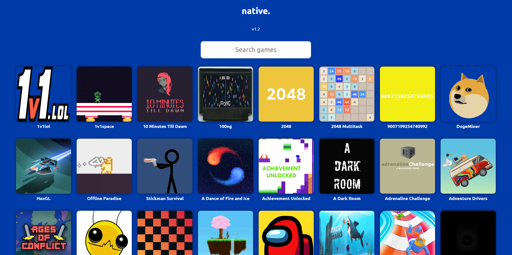

<div align=center> 
</div>

<h1 align=center> Native. Unblocked games site template </h1>

### Introduction:

This repository provides a simple template for creating unblocked games sites. The template includes basic HTML, CSS, and JavaScript files that you can customize according to your preferences.

### Getting Started:

To get started, follow these steps:

1. **Fork the Repository:**
   Fork this repository by clicking on the "Fork" button in the top-right corner of this page. This will create a copy of the repository in your GitHub account.

2. **Set Up GitHub Pages:**
   After forking the repository, go to the "Settings" tab of your forked repository. Scroll down to the "GitHub Pages" section and select the branch you want to use for GitHub Pages (typically, you would choose the "main" branch). GitHub Pages will now host your site.

3. **Edit `main.js`:**
   Open `main.js` located in `config/main.js` with a text editor. In this file, you can change the `sitename` variable to your desired name. This variable controls both the tab title and the text displayed on the page. For example:

   ```javascript
   var sitename = "Your Site Name";
   ```

   Changing this variable will update the title of the tab and certain text elements on the page accordingly.

4. **Customize CSS:**
   Open `main.css` located in `config/main.css`. Here, you can customize the site's appearance by changing variables such as background color, text color, and accent color:

   ```css
   :root {
     --background-color: #41444e; /* Change this to your preferred background color */
     --text-color: white; /* Change this to your preferred text color */
     --accent-color: #404040; /* Change this to your preferred accent color */
   }
   ```

5. **Custom JavaScript and CSS:**
   If you want to add custom JavaScript or CSS, you can use `custom.js` and `custom.css` located in the `config` directory. Simply add your custom code to these files.

6. **Save Changes:**
   Save all your changes.

7. **Deploy Your Site:**
   Your site is now live on GitHub Pages! You can access it at `https://<your-github-username>.github.io/<repository-name>`.

### Usage:

After customizing the template according to your preferences, your unblocked games site is ready for use. Users can navigate through the site, play games, and enjoy the content.

### Contributing:

If you have any suggestions for improvements or would like to contribute to this template, feel free to submit a pull request or open an issue.

### License:

This project is licensed under the [MIT License](LICENSE).

### Disclaimer:

do not remove the "a site by parcoil network" text at the bottom of the site, as doing so violates our Terms of Service.

---

Feel free to modify this README according to your specific requirements. If you have any further questions or need assistance, don't hesitate to reach out. Happy coding!
